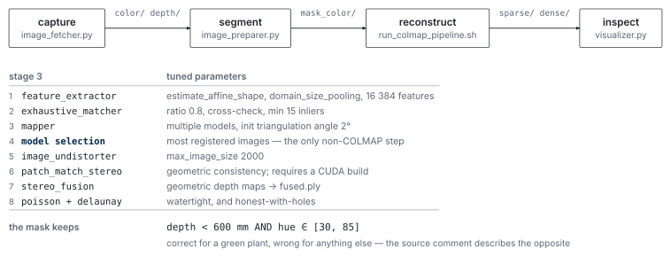

# VisRecon

A small multi-view reconstruction toolkit: capture RGB-D sequences from an Intel
RealSense camera, segment the subject, run a scripted COLMAP pipeline from
features through to a mesh, and inspect the result. Built for plant
reconstruction in an agricultural-robotics setting, and kept general enough to
point at anything else.

[](LICENSE)
[](#project-status)


## Overview



*Four stages joined by a directory convention. The stage-3 parameters are tuned for a thin, self-similar subject.*

Five small tools, each doing one step, joined by a directory convention rather
than by a framework:

```text
capture  →  segment  →  reconstruct  →  inspect
  │            │             │              │
image_fetcher  image_preparer  run_colmap_pipeline.sh  visualizer
                              (8 COLMAP stages)
```

`dataset_downloader` is the sixth tool and sits outside that chain: it pulls a
named subset from a Hugging Face dataset repository when you want to work from
someone else's images instead of your own.

The reason the tools are separate scripts rather than a package is that the
expensive step — dense reconstruction — takes minutes to hours, and you almost
always want to re-run it with different parameters against images you already
have. Nothing here re-captures or re-segments unless you ask it to.

## Repository layout

```text
.
├── utils/
│   ├── image_fetcher.py          # RealSense capture, manual or timed
│   ├── image_preparer.py         # capture + depth/colour masking
│   ├── dataset_downloader.py     # fetch a subset from a HF dataset repo
│   ├── run_colmap_pipeline.sh    # the 8-stage COLMAP pipeline
│   └── visualizer.py             # Open3D viewer for point cloud or mesh
├── samples/                      # 40 sample multi-view images
├── demo/plants/                  # rendered results: 3 point clouds, 3 meshes
├── requirements.txt
└── LICENSE
```

## Requirements

- Python 3.10 or later.
- [COLMAP](https://colmap.github.io/) on `PATH`, built with CUDA if you want
  dense reconstruction to finish in reasonable time.
- An Intel RealSense device, for the capture scripts only. Everything downstream
  works on any image set.

```bash
python -m venv .venv
source .venv/bin/activate          # Windows: .venv\Scripts\activate
pip install -r requirements.txt
```

`pyrealsense2` is the only hardware-specific dependency; if you are working from
existing images you can skip it.

## Usage

### Capture

```bash
python utils/image_fetcher.py --help
python utils/image_preparer.py --help
```

Both take a save directory and a frame count, and offer a manual mode (one frame
per keypress) and an automatic mode (one frame every `--interval` seconds).
`image_preparer.py` additionally writes masked copies.

### Download an existing dataset

```bash
python utils/dataset_downloader.py \
  --repo_id username/dataset \
  --subset path/to/subset \
  --local_dir ./data
```

### Reconstruct

```bash
bash utils/run_colmap_pipeline.sh
```

The script reads from `./mask_color` and writes `./database.db`, `./sparse/` and
`./dense/` **in the current working directory** — those paths are constants at
the top of the file, so run it from the directory holding your images or edit
them first. It runs feature extraction, exhaustive matching, sparse mapping,
best-model selection, undistortion, PatchMatch stereo, fusion, and both a Poisson
and a Delaunay mesh.

### Inspect

```bash
python utils/visualizer.py <project_dir> -t f   # fused point cloud
python utils/visualizer.py <project_dir> -t p   # Poisson mesh
python utils/visualizer.py <project_dir> -t d   # Delaunay mesh
```

`<project_dir>` is the directory containing `dense/`, used exactly as given.

## Samples and demo output

`samples/` holds a 40-image input sequence so the pipeline can be tried without
a camera. `demo/plants/` holds rendered point-cloud and mesh results from three
plant reconstructions — they show what a good result looks like, which is more
useful than a written description when you are deciding whether your own run
worked.

## Project Status

Experimental. A working research toolkit: it needs a RealSense camera for
capture and a COLMAP install for reconstruction.

## Contributing

Bug fixes, documentation improvements and genuinely reusable utilities are
welcome. Open an issue before a substantial workflow change; the directory
convention between the stages is what joins them.

## License

Source code is available under the [MIT License](LICENSE). COLMAP, Open3D,
librealsense and any downloaded dataset carry their own licenses; check them at
their own sources.

## Contact

- Website: [yixuanhuang.com](https://yixuanhuang.com)
- Email: [yixnhuang@gmail.com](mailto:yixnhuang@gmail.com)
